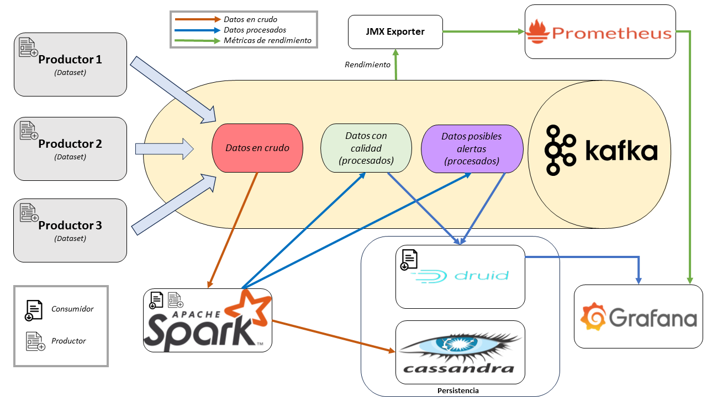

# TFG_Kafka
Material desarrollado y empleado a lo largo del Trabajo de Fin de Grado: *Diseño e implementación de un servicio de monitorización y aseguramiento de la calidad y seguridad de datos publicados en Kafka*.

------------------------------------------

## Resumen:

Hoy en día, con el establecimiento de las nuevas tecnologías en las actividades económicas en todos sus sectores, destaca la aplicación del IoT (*Internet of Things*), donde gran parte de los procesos recaen en el trabajo llevado a cabo por un amplio despliegue de dispositivos (computadores, sensores, etc) conectados a la red.

Este proyecto, implementa un servicio de análisis, procesado y monitorización de datos disponibles en una plataforma *big data* distribuida y escalable, bajo una arquitectura centrada en el dato e implementada mediante el gestor de datos Kafka y con aplicación a casos de uso del sector industrial.

En concreto, aborda la programación de reglas para la gestión de alarmas relativas a aspectos de calidad de los datos; genera un cuadro de mandos (*dashboard*) que permite la monitorización gráfica tanto del rendimiento de la plataforma como de los datos que se publican en ella, así como garantiza en todo este proceso la seguridad del entorno, con diversas políticas tanto de autorización como de autenticación. Además, durante el desarrollo, se barajaron alternativas para la elección del sistema de persistencia y se analizaron sus ventajas e inconvenientes con el foco en la monitorización.

------------------------------------------
## Memoria:

*https://hdl.handle.net/10902/30033*

------------------------------------------

## Estructura del repositorio:
* **Certificados Kafka**: Certificados utilizados para autenticar a los *principals* de Kafka. Se encuentran divididos en carpetas para cada *principal*.

  Autoridades de Certificación:
  - BrokersCA
  - ClientesCA
  
  *Principals*:
  - mario (Broker1)
  - Admin (Administrador)
  - Druid
  - Productor
  - Spark-Cassandra
* **Configuraciones**: Ficheros *.yml* y *.properties* utilizados para configurar Kafka y otras tecnologías conectadas.
  - Exporter
  - Kafka
  - Prometheus
  - Zookeeper
* **DashboardsGrafana**: Cuadros de mando elaborados con Grafana para la monitorización de Kafka y la visualización de datos del *dataset* MetroPT.
* **KttmSpark**: Programa Spark utilizado para el *dataset* del juego web, *Koalas to the Max*.
* **ProductorJavaGeneric**: Programa Java encargado de leer un fichero de datos como parámetro y mandar sus filas al tópico indicado de Kafka.
* **TrainSpark**: Programa Spark utilizado para el *dataset* MetroPT.

------------------------------------------

## Arquitectura y solución software empleada:

------------------------------------------

## Fuentes de datos:
* **Datos ambientales**: https://datos.santander.es/dataset/?id=sensores-ambientales
* **Datos de juego web** (*Koalas to the Max*): https://static.imply.io/example-data/kttm-nested-v2/kttm-nested-v2-2019-08-25.json.gz
* **Datos de metro de Oporto** (*MetroPT*): https://zenodo.org/record/6854240

------------------------------------------

## Contacto:
* **Autor**: Mario Martín Pérez (mario.martin@alumnos.unican.es)
